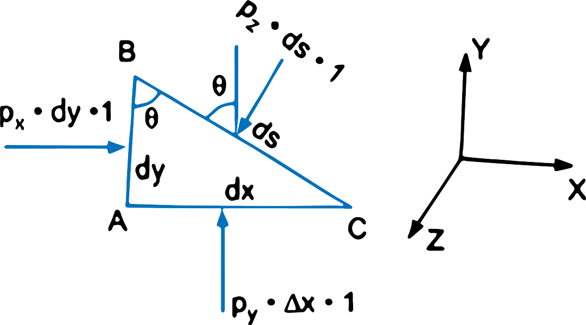

<h3>Fluid Pressure At A Point</h3>

COnsider a small area dA in large mass of fluid. If the fluid is stationary, then the force exerted by the surrounding fluid on the dA will always be perpendicular to the surface dA. Let dF is the force acting on the area dA is in normal direction. Then the ratio of dF/dA is known as the intensity of pressure or simply pressure and this ratio is represented by p. Hence mathematically th epressure at a point in a fluid at rest is

$$ p = \frac{dF}{dA} $$

If the force (F) is uniform distributed over the area (A), then presssure at any point is given by

$$ p = \frac{F}{A} = \frac{Force}{Area} $$

&therefore; Force or pressure force, F = p x A

  

<h3>Pascal's Law</h3>

$$ Figure\ 1 $$

It states the pressure or intensity of pressure at a point in a static fluid is equal in all directions. This is provided as: 

The fluid element is of very small dimensions i.e dx, dy and ds

Consider an arbitrary fluid element of wedge shape in a fluid mass at rest as shown in figure 1. Let the width of the element prependicular to the plane of paper is unity and px, py and pz are the pressures or intensity of pressure acting on the face AB, AC and BC respectively. Let &angle;ABC = &theta;. Then the forces acting on the element are: 

<ol type='i'>
    <li>Pressure forces normal to the surface, and</li>
    <li>Weight of element in the vertical direction.</li>
</ol>

The forces on the faces are: 

Force on the face AB

$$ = p_x \times Area\ of\ face\ AB $$

$$ = p_x \times d_y \times 1 $$

Similarly force on the face AC

$$ = p_y \times d_x \times 1 $$

Forces on the face BC

$$ = p_z \times d_s \times 1 $$

Weight of element

$$ = (Mass\ of\ element) \times g $$

$$ = (Volume \times \rho) \times g = \left(\frac{AB \times AC \times 1}{2} \right) \times \rho \times g $$

where &rho; is density of fluid

Resolving the forces in x-direction, we have

$$ p_x \times d_y \times 1 - p(ds \times 1) \times sin(90^o - \theta) = 0 $$

or

$$ p_x \times d_y \times 1 - p_zds \times cos(\theta) = 0  $$

But from figure 1

$$ ds\ cos(\theta) = AB = dy  $$

$$ p_x \times dy \times 1 - p_z \times dy \times 1 = 0  $$

$$ p_x = p_z  $$

Similarly, resolving the forces in y-direction , we get

$$ p_y \times dx \times 1 - p_z \times ds \times cos(90^o - \theta) - \frac{dxdy}{2} \times 1 \times \rho \times g = 0  $$

or

$$ p_y \times dx -  p_z \times sin(\theta) - \frac{dxdy}{2} \times \rho \times g = 0 $$

or

But ds sin(&theta;) = dx and also the element is very small and hence weight is negligible.

$$ \therefore \ \ \  p_ydx - p_z = 0 $$

or

$$  p_y = p_z $$

From above equations we have

$$ p_x = p_y = p_z $$

The above equation shows that the pressure at any point in x, y and z directions is equal. Since the choice of fluid element was completely arbitrary, which means the pressure at any point is same in all directions.

  

<h3>Pressure Variation In A Fluid At Rest</h3>

The pressure at any point in a rest is obtained by the hydrostatic lay which states that the rate of increase in a vertically downward dirstion must be equal to the specific weight of the fluid at that point. This is proved as: 

Consider a small fluid element as shown in the figure 2

Let &Delta;A be cross-sectional area of element, &Delta;Z be height of fluid element, p be the pressure on face AB, Z is distance of fluid from free surface.

Force acting on fluid elements are

<ol type='i'>
<li>Pressure force on AB = p &times; &Delta;A and acting perpendicluar to face AB in the downward direction.</li>
<li>Pressure force on CD  = p + ((&delta;p/&delta;Z ) &times; &Delta;Z) &times; &Delta;A, acting perpendicular to face CD, vertically upward direction </li>

<li>

$$ Weight of fluid element = Density \times g \times Volume \times (\Delta A  \times \Delta Z ) $$ 

</li>

<li>Pressure forces on surface BC and AD are equal and opposite. For equilibrium of fluid elment, we have

$$ p \Delta A - \left( p + \frac{\partial p}{\partial z} \Delta Z \right) \Delta A + \rho \times g \times (\Delta A \times \Delta Z) = 0 $$

or

$$ p \Delta A - p \Delta A - \frac{\partial p}{\partial Z} \Delta Z \Delta A + \rho \times g \times \Delta A \times Z = 0  $$ 

$$ - \frac{\partial p}{\partial Z} + \rho \times g \times \Delta A \Delta Z = 0  $$ 

$$ \frac{\partial p}{\partial Z} = \rho \times g  $$ 

$$\therefore \ \ \ \ \  \frac{\partial p}{\partial Z} = \rho \times g  = w \ \ \ \ \ \ \ \ \ \ \ (\because \rho \times g = w) $$ 

where w is weight density of fluid

The above equation states that rate of increase of pressure in a vertical direction is equal to weight density of the fluid at that point. This is Hydrostatic Law.

By integrating the equation for liquids, we get

$$ \int dp = \int \rho g dZ  $$ 

$$ p = \rho g Z  $$ 

where p is pressure above atmospheric pressure and Z is the height of the point from free surfaces.

From the last equation, we have

$$ Z = \frac{p}{\rho \times g}  $$

Here Z is called the pressure head.

</li>

</ol>

